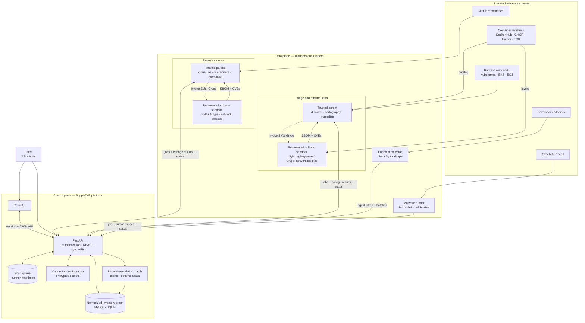

# SupplyDrift

[](LICENSE)

Most Software Composition Analysis tools start from declared dependency intent:
`package-lock.json`, `go.sum`, `requirements.txt`, container build inputs, or
other manifests. That view is useful, but incomplete. Real systems also fetch,
execute, ship, and run components that never appear in those files — **phantom
dependencies**: anything trusted by a repository, build, image, cluster, or
endpoint that is invisible to lockfile-centered SCA.

Lockfiles answer one narrow question — what a package manager resolved at one
point in time. They do not tell you what CI downloaded and executed (`curl | bash`,
unpinned GitHub Actions, `npx`/`pip install <url>`), what OS packages and shared
libraries actually shipped in a container image, which images are live in a
Kubernetes cluster and whether they came from a sanctioned pipeline, or which
developer machines hold local evidence of a compromised package. SupplyDrift
treats the repository, the shipped image, the running cluster, and the endpoint
as **independent sources of truth**, aggregates them into one inventory, and
reports the gap against the declared-dependency view.

## Components

| Path | What it answers | Stack |
| --- | --- | --- |
| [`platform/`](platform/) | The product surface: one searchable inventory across every source, CVE and malware (OSV `MAL-*`) views, a dependency graph API, UI-driven scans (job queue + polling runners), and authentication | React UI + FastAPI API; MySQL (compose default) or SQLite (dev) |
| [`github-shadow-deps/`](github-shadow-deps/) | **Vector 1 — repositories:** what a repo *actually* trusts beyond its manifests — 26 phantom-dependency scanners plus syft (declared deps) + grype (CVEs), deduped into one payload | Python CLI (`github-inventory`) |
| [`image-scanner/`](image-scanner/) | **Vectors 2 & 3 — images and runtime:** ground-truth SBOMs + CVEs for container images across registries (Docker Hub / GHCR / Harbor / ECR) and live Kubernetes / EKS / ECS workloads, including shadow-deployment detection (bundled `k8s_cartographer`) | Python CLI |
| [`endpoint-dep-inventory/`](endpoint-dep-inventory/) | **Vector 4 — endpoints:** which developer machines have local evidence of a package/version, for compromised-package response | Bash collector (Syft + Grype) |
| [`supplydrift-sandbox/`](supplydrift-sandbox/) | Shared Syft/Grype execution boundary used by the Compose repository and image runners: per-invocation filesystem capabilities, minimal environments, network policy, and child-process cleanup | Python + pinned `nono` |

## How it fits together

Every scanner normalizes its results into the same shape and pushes to the
platform's per-source sync APIs (`POST /api/sync/*`); the platform dedupes
packages by identity (purl), so the same component seen by the repo, image, and
endpoint scanners converges on one record. Scans run on demand from the UI: a
job queue hands work to long-running scan runners, which fetch per-connector
config (and secrets, scoped to the claimed job) from the platform. See
[`docs/architecture.md`](docs/architecture.md) for the scanner pipelines,
data model, and runtime-flow details.

### Architecture at a glance



Only the attached Syft/Grype children run inside a fresh Nono boundary; dotted
arrows mark those restricted invocations. Bidirectional platform edges combine
outbound jobs/configuration with inbound results/status. Endpoint collection,
native discovery, and the long-lived runner parents remain outside the sandbox.
For image Syft, `*` means Compose may use its logged, unrestricted-egress
fallback when the registry proxy is unavailable; filesystem and credential
isolation remain enforced.

## Security Model

SupplyDrift assumes that every scanned repository, image, and package is
hostile. The platform and runner parent processes are trusted; Syft and Grype
are treated as parsers of attacker-controlled content and receive only the
capabilities needed for one target.

### What is enforced today

- **Credential-safe findings and exports.** Repository findings are redacted at
  the model boundary and checked again before enrichment, JSON, SARIF, table
  output, and platform synchronization. Registry credential findings retain the
  credential type and registry host, but not the credential, source value, or a
  fingerprint. Syft/Grype stdout and stderr also have exact child credential
  values removed before they leave the sandbox boundary.
- **Target policy is untrusted by default.** A scanned repository's
  `.github-inventory.yml` is ignored unless the operator explicitly passes
  `--trust-target-config`. Normal CI and remote scans should use an
  operator-owned policy selected with `--config /trusted/policy.yml`. Policy
  files use a strict version-1 schema; ignore regexes are limited to 100 rules,
  512 characters per pattern, and 25 ms per match. Platform-driven repository
  scans start with default policy and do not consume target-owned policy.
- **Per-target parser isolation.** The Compose image and repository runners
  require pinned `nono` 0.67.1 and run a filesystem, environment, `/proc`, and
  blocked-network preflight before accepting work. Each Syft/Grype invocation
  gets a fresh home, cache, temporary directory, capability manifest, and
  process reaper. Application code and the prebuilt Grype database are
  root-owned and read-only.
- **Minimal credential exposure.** Runner, Kubernetes, AWS, and ambient Docker
  credentials stay in the trusted parent. Target-specific clone and pull
  credentials are resolved per job; image Syft receives only the credential for
  its current registry. Grype and repository Syft do not receive publisher or
  cloud credentials. Omitted image authentication is anonymous rather than an
  implicit ambient Docker login.
- **Constrained network access.** Repository Syft and all Grype jobs have
  networking blocked. Image Syft uses a target-scoped registry proxy, with only
  the known token/blob hosts needed by Docker Hub, GHCR, Quay, or ECR added for
  those registries.
- **Narrow secret-scan exceptions.** The working-tree Gitleaks check is a
  blocking gate, while a separate full-history sweep reports historical leaks.
  Allowlists match both an exact fixture path and an exact synthetic value; CI
  canaries verify that unrelated secrets in formerly exempt paths are still
  detected.

The implementation details live in
[`supplydrift-sandbox/`](supplydrift-sandbox/), the repository scanner's
[`README`](github-shadow-deps/README.md#configuration), and the image scanner's
[`authentication guide`](image-scanner/docs/AUTHENTICATION.md).

### Scanner policy examples

```bash
# Recommended for remote or otherwise untrusted repositories:
github-inventory scan https://github.com/org/repo \
  --config /opt/supplydrift/policy.yml

# Only for a repository whose policy you trust:
github-inventory scan ./internal-repo --trust-target-config
```

`--config` and `--trust-target-config` are mutually exclusive. The second form
prints a warning because target-owned ignore rules can suppress findings.

### Sandbox settings

| Setting | Values | Guidance |
| --- | --- | --- |
| `SUPPLYDRIFT_TOOL_SANDBOX` | `required`, `auto`, `off` | Compose uses `required` and refuses to scan if enforcement cannot be proven. `auto` is the source-tree development default and may run locally without isolation after warning. `off` is an explicit local-only escape hatch. |
| `SUPPLYDRIFT_SANDBOX_NETWORK` | `require`, `best-effort` | `require` fails an image pull if the registry proxy cannot be enforced. Compose defaults to `best-effort`, which keeps filesystem and credential isolation but may use unrestricted pull egress after a structured warning. Blocked-network jobs never fall back. Override the runner environment entry to select `require`. |

Sandbox decisions are emitted as JSON events with
`event: "supplydrift_tool_sandbox"`. Production monitoring should alert on
`filesystem_enforced: false` or `network_mode: "unrestricted-fallback"`.

### Deployment checklist

Before exposing SupplyDrift beyond a local workstation:

1. Keep authentication enabled and terminate TLS in front of the platform.
2. Set unique MySQL passwords and a separately stored
   `SUPPLYDRIFT_SECRET_KEY`; never place that key in the database or its backups.
3. Use the hardened Compose runners as the reference deployment, or reproduce
   their read-only filesystem, dropped capabilities, non-root user, ephemeral
   state, resource limits, and mandatory sandbox in your orchestrator.
4. Mount kubeconfig and optional AWS files read-only, use least-privilege
   identities, and avoid mounting a general-purpose Docker credential store.
5. Use external scanner policy for untrusted targets. Do not enable
   `--trust-target-config` in a shared or public scanning service.
6. Override the runner environment with
   `SUPPLYDRIFT_SANDBOX_NETWORK=require` where unrestricted registry egress is
   unacceptable, and monitor sandbox fallback events otherwise.
7. Rebuild runner images regularly so their immutable Grype database and pinned
   scanner binaries receive reviewed updates.
8. Treat scan results as sensitive operational data. Redaction limits credential
   leakage; it does not make repository paths, package inventories, or findings
   safe for public distribution.

For the complete deployment guidance, see
[`docs/local-docker-compose.md`](docs/local-docker-compose.md#security-notes) and
[`SECURITY.md`](SECURITY.md#hardening-guidance-for-deployers).

> **Upgrading from an earlier build:** redaction is applied when new findings
> are created or serialized; it does not rewrite old JSON/SARIF files, logs,
> database rows, or backups. Review and remove old artifacts, rotate any exposed
> credentials, and rescan affected targets.

## Quick Start

The product surface (UI + API) lives in `platform/`. Two ways to run it.

### Docker — simplest, nothing to install but Docker

Requires Docker Engine with the Compose v2 plugin. The UI is built into the
image; MySQL and the image / github / malware scan runners come up alongside
the platform:

```bash
cp .env.example .env
# In .env, set:
#   SUPPLYDRIFT_ADMIN_USER / SUPPLYDRIFT_ADMIN_PASSWORD  (first-run admin login)
#   MYSQL_PASSWORD / MYSQL_ROOT_PASSWORD                 (compose refuses to start without them)
#   SUPPLYDRIFT_SECRET_KEY                               (required to store source credentials;
#                                                         generator one-liner is in .env.example)
docker compose up -d        # MySQL + platform + scan runners at http://localhost:8765
```

For the complete local workflow, including environment setup, public test
sources, Docker Desktop Kubernetes, endpoint scanning, verification, logs, and
safe cleanup, see
[`docs/local-docker-compose.md`](docs/local-docker-compose.md). The guide uses
`scripts/local-compose.sh` to keep the normal workflow to a few commands.

**Authentication is on by default.** The first admin is seeded **once** from the
two admin env vars (on an empty DB); log in, then mint machine tokens under
**Access → API tokens**. The bundled runners authenticate **automatically** —
the platform generates a runner token and shares it over an internal volume
(zero-touch). For a trusted local/dev box, set `SUPPLYDRIFT_AUTH=disabled` in
`.env` to skip login entirely. Full auth details:
[`platform/README.md`](platform/README.md#authentication).

### Without Docker — local dev

You must build the React UI **once**: it's a build artifact and is not
committed, so a fresh clone serves a plain `SupplyDrift API` text page until you
build it. Requires Python 3.12+ and Node.js 20+. This path uses the SQLite
fallback datastore.

```bash
# 1) build the UI (creates platform/frontend/dist)
cd platform/frontend && npm ci && npm run build && cd ..
# 2) run the API + UI together on one port (auth off for a quick local spin)
pip install -r requirements.txt
SUPPLYDRIFT_AUTH=disabled python3 run.py --load-demo    # open http://127.0.0.1:8765
```

See [`platform/README.md`](platform/README.md) for the configuration reference,
the frontend dev server (`:5173` hot reload), running scan runners, and
Kubernetes scanning.

### Try a scanner standalone (no platform needed)

Each scanner can also write results directly to a JSON file without the
platform. A local repository scan can run offline; remote repositories and
container images still require network access to clone or pull their target.

```bash
# Repository scan (from github-shadow-deps/, after pip install -r requirements.txt)
python3 scan.py scan /path/to/repo --format json

# Container image scan (needs syft; from image-scanner/, after pip install -r requirements.txt)
python3 image_scan.py alpine:3.20 -o image.json

# Endpoint collector smoke test (needs syft + jq; from endpoint-dep-inventory/)
./tests/collector-smoke.sh
```

See each component's README for full usage:
[`github-shadow-deps/`](github-shadow-deps/README.md),
[`image-scanner/`](image-scanner/README.md),
[`endpoint-dep-inventory/`](endpoint-dep-inventory/README.md).

## Repository Layout

```text
.
|-- platform/                 # Product surface: React UI + FastAPI API (MySQL/SQLite)
|-- image-scanner/            # Registry/image + Kubernetes/EKS/ECS SBOM scanner & runners
|-- github-shadow-deps/       # Repository-level phantom dependency scanner
|-- endpoint-dep-inventory/   # Syft-based endpoint inventory collector
|-- supplydrift-sandbox/      # Shared per-target Syft/Grype isolation library
|-- docs/                     # Architecture diagrams and system notes
`-- README.md                 # Overall project framing
```

> **A note on naming:** the product and repository are named **SupplyDrift**.
> The repository scanner's Python package and CLI are named `github-inventory`
> (see `github-shadow-deps/pyproject.toml`), while its component directory
> remains `github-shadow-deps/`.

## Status & Roadmap

**Works today:** all four vectors are implemented and feed one platform —
repository scanning (26 phantom-dependency scanners + syft/grype), registry and
image scanning (Docker Hub / GHCR / Harbor / ECR), live Kubernetes / EKS / ECS
workload cartography with shadow-deployment findings, and endpoint collection.
The platform aggregates everything into a searchable inventory with
vulnerability and OSV `MAL-*` malware views, UI-driven scans, and
role/token-based authentication. Every component has a test suite. `bash ci.sh`
runs the platform, image-scanner, repository-scanner, frontend, and endpoint
checks, while `bash e2e-cli.sh` round-trips real scans through a throwaway
platform. The shared sandbox suite is currently run separately from its
directory with `python -m pytest`.

**Product roadmap:**

- SPDX output alongside CycloneDX.
- EOL / base-image enrichment on top of the existing CVE mapping.
- Lockfile/SCA versus observed-inventory **delta reporting** as a first-class report.
- Background per-connection asset discovery on a schedule (today scans are on-demand).
- A UI view for the existing dependency-graph API (`GET /api/graph`).

The core principle stays the same: do not trust any single artifact as the full
source of truth. Compare all observable layers and report the delta.

## Known Gaps and Future Scope

The current controls materially reduce risk, but they are not a complete
security boundary for every deployment:

- **Fail-closed image-pull egress everywhere.** Compose currently uses
  `best-effort` because target-scoped proxy enforcement is not supported on
  every host. If proxy setup is unavailable, image Syft keeps filesystem and
  credential isolation but receives unrestricted egress. Operators can override
  the runner with `SUPPLYDRIFT_SANDBOX_NETWORK=require` today; broader proxy
  support and making fail-closed the portable default remain future work.
- **Wider sandbox coverage and deployment parity.** The mandatory capability
  boundary covers Syft and Grype in the Compose runners. Git clone, connector
  discovery, kubectl/AWS execution, the native Python scanners, local `auto`
  mode, the endpoint collector's direct Syft/Grype calls, and custom
  Kubernetes/VM deployments are not automatically placed in the same
  per-target sandbox. Future work should isolate those stages and ship
  equivalent hardened orchestration manifests.
- **Per-connector runner-token authorization.** A runner process requests only
  the connector for its claimed job, but the runner token itself can request
  any connector. A stolen runner token can therefore expose all stored source
  credentials. Connector-bound runner identities are planned.
- **API token expiry.** API tokens remain valid until explicitly revoked.
  Optional expiry, enforcement during token resolution, and UI support are
  planned; rotate runner and machine tokens operationally in the meantime.
- **Automated vulnerability-database refresh.** The Grype database is immutable
  inside a running image so an untrusted parser cannot persist changes. It is
  refreshed only during a reviewed runner-image rebuild. A signed, staged
  update workflow outside the parser boundary is future work.
- **Historical-data scrubbing and unknown secret formats.** Central redaction
  covers known credential formats and all current repository output paths, but
  it is not a general data-loss-prevention system and is not retroactive.
  Automated migration/scrubbing of historical data and broader structured
  secret classification remain future work.
- **Blocking history and sandbox CI coverage.** Gitleaks history scanning is
  currently informational, and `bash ci.sh` does not yet run the shared
  `supplydrift-sandbox` tests. Future CI should gate newly introduced historical
  leaks and run the sandbox unit and runtime smoke suites on a compatible Linux
  host.
- **Continuous third-party parser hardening.** Pinned versions, checksums,
  read-only code, and sandboxing reduce exposure; they do not eliminate parser
  vulnerabilities. Continue rebuilding, testing, and reviewing Syft, Grype,
  `nono`, base images, and their transitive dependencies.

## Contributing

Contributions are welcome. See [`CONTRIBUTING.md`](CONTRIBUTING.md) for the
component map, dev setup, and how to run the checks (`bash ci.sh`), and
[`CODE_OF_CONDUCT.md`](CODE_OF_CONDUCT.md) for community expectations.

**Contributors**
<div align="center">

---

<a href="https://github.com/suchithnarayan/supplydrift/graphs/contributors">
  
</a>
</div>

## Security

The runtime controls and limitations are summarized in
[Security Model](#security-model) and
[Known Gaps and Future Scope](#known-gaps-and-future-scope). Please report
vulnerabilities privately — do **not** open a public issue. See
[`SECURITY.md`](SECURITY.md) for the reporting process and scope.

## License

Licensed under the Apache License, Version 2.0. See [`LICENSE`](LICENSE).
Notices for standalone third-party binaries are listed in
[`ThirdPartyNotices.txt`](ThirdPartyNotices.txt).
