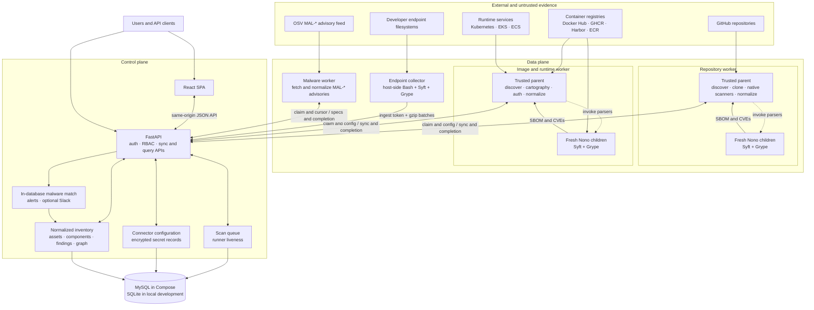
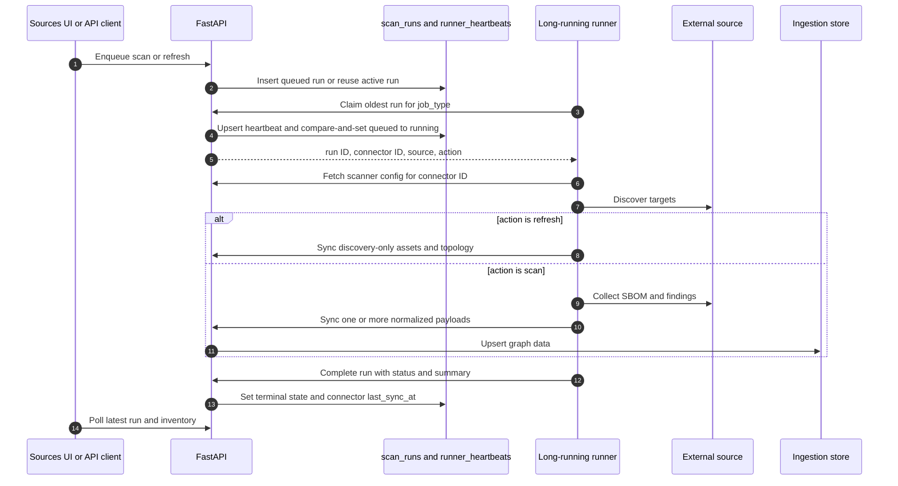
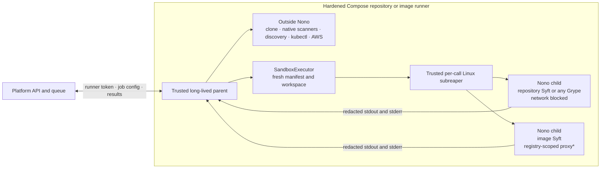
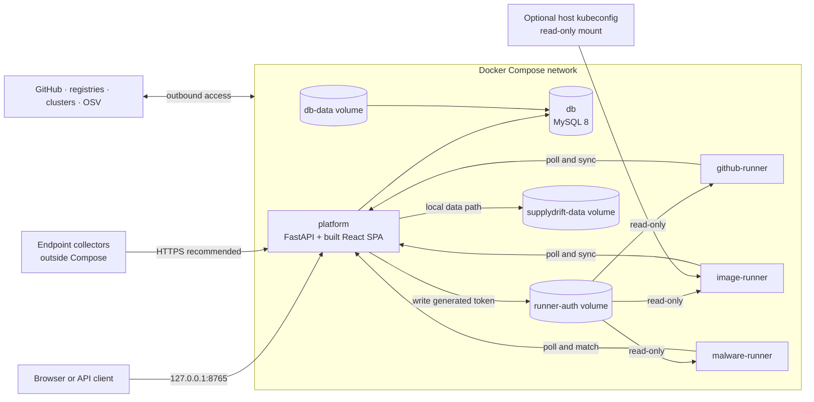

# SupplyDrift Architecture

SupplyDrift combines independent supply-chain evidence from source repositories,
container images, live workloads, and developer endpoints. Scanner results are
normalized into one asset/component/finding graph and exposed through a React
single-page application and a FastAPI API.

This document describes the current implementation. The root
[README architecture](../README.md#architecture-at-a-glance) is the condensed
operator view; this file is the detailed reference for component boundaries,
runtime flows, storage, sandboxing, and current limitations.

## Architectural Principles

1. **Treat each evidence vector independently.** A repository manifest, shipped
   image, running workload, and endpoint filesystem can disagree. SupplyDrift
   records each observation instead of treating one as authoritative for all
   others.
2. **Normalize at the platform boundary.** Scanners emit source-specific
   evidence, but the platform stores stable assets, shared package identities,
   occurrences, relationships, and findings.
3. **Separate orchestration from collection.** The platform owns connector
   configuration, authentication, queue state, inventory, and presentation.
   Long-running workers perform network and CPU-intensive scans.
4. **Assume scan targets are hostile.** Trusted runner parents perform discovery
   and orchestration. Syft and Grype, which parse attacker-controlled content,
   run in fresh capability sandboxes in the hardened Compose runners.
5. **Keep CVE and malware workflows distinct.** Grype produces CVE findings
   during a source scan. OSV `MAL-*` monitoring is a separate, inventory-wide
   delta workflow.

## System Context



The queue, connector store, and inventory blocks above are logical parts of the
same platform `Store` and relational database. SupplyDrift does not use a
separate message broker or graph database.

## Trust Boundaries

| Boundary | Trust level | Responsibilities |
| --- | --- | --- |
| Browser and API clients | Authenticated but not trusted | Submit commands and queries through authorization and CSRF controls |
| Platform API and database | Trusted control plane | Authorize requests, store secrets and normalized evidence, coordinate work |
| Repository and image runner parents | Trusted data plane | Claim jobs, fetch scoped config, resolve credentials, discover targets, normalize and publish |
| Syft and Grype children | Hostile-parser boundary | Parse one explicit target with a minimal environment, filesystem capabilities, and network policy |
| Repositories, images, workload metadata, endpoint contents, OSV data | Untrusted input | Evidence to inspect and normalize |
| Endpoint collector host process | Locally trusted deployment agent | Read configured host roots and upload a minimized inventory; it is not in the Nono boundary |

The per-invocation sandbox is deliberately narrower than the runner container.
Git clone, the native Python repository scanners, registry APIs, `kubectl`,
AWS CLI, normalization, and publication run in the trusted parent. This keeps
credentials and orchestration outside untrusted parser children while making
the remaining trust in the parent explicit.

## Control Plane

### Web and API surface

- FastAPI serves both the compiled React SPA and the `/api/*` routes from one
  origin. The UI covers Dashboard, Inventory, Endpoints, SBOM Analyzer,
  Vulnerabilities, Malware Analysis, Sources, and Access.
- The API is a transport layer over `platform/app.py::Store`. The Store owns
  connector configuration, queue operations, ingestion, normalization, queries,
  graph traversal, malware matching, and persistence.
- Heavy list endpoints support `limit`/`offset` or `page` pagination. Graph and
  blast-radius queries are API-only in the current UI.
- Scanner uploads may be gzip encoded. The default compressed request limit is
  64 MiB and the inflated limit is 256 MiB, preventing unbounded request and
  gzip-bomb expansion.
- OpenAPI and interactive docs are disabled unless
  `SUPPLYDRIFT_INSECURE=1`. CORS is limited to the configured public origin,
  plus local Vite origins in insecure development mode.

### Authentication and authorization

Human and machine principals resolve to the same capability policy:

| Principal | Authentication | Capabilities |
| --- | --- | --- |
| `admin` | HttpOnly session cookie | read, operate, admin, queue, ingest |
| `member` | HttpOnly session cookie | read, operate |
| `viewer` | HttpOnly session cookie | read |
| `runner` token | Bearer token | queue, ingest |
| `ingest` token | Bearer token | ingest |
| `readonly` token | Bearer token | read |

Session cookies are HttpOnly, SameSite=Lax, secure outside explicitly insecure
development, and expire after 12 hours. Cookie-authenticated mutations require
an `X-CSRF-Token`; bearer-token calls do not. Passwords use scrypt, API tokens
are stored only as SHA-256 hashes, and plaintext tokens are shown once.

Login throttling is database-backed so it works across restarts and workers:
five failures per username in a five-minute window, plus a source-IP cap of 50
by default. API tokens can be revoked but currently have no automatic expiry.
Authentication can be disabled for trusted local development; public-peer and
non-loopback startup rails require an explicit override in that mode.

### Connector configuration and secrets

The UI manages GitHub, Docker Hub, GHCR, Harbor, ECR, Kubernetes, EKS, and ECS
connectors. Connector topology, discovery, filters, and scan options are stored
as visible JSON. Secret values follow a separate path:

1. `connection.auth.password`, `token`, and `secret` are removed from visible
   connector JSON.
2. Each value is encrypted with Fernet under `SUPPLYDRIFT_SECRET_KEY` and stored
   in `connector_secrets`. Secret-shaped values in unsupported locations and
   inline kubeconfig content are rejected rather than persisted visibly.
3. Browser responses expose only configured field names or masks, including for
   administrators.
4. Only a bearer principal with `runner` scope receives decrypted scanner
   configuration. Bundled runners request the connector ID from the job they
   just claimed.
5. In Compose, the platform creates a mode-0600 runner token in a shared volume;
   workers mount that volume read-only. The encryption key is supplied only to
   the platform service.

Connector scoping is operational rather than an authorization boundary. A
runner token can request any connector ID, or omit the ID and receive all
scanner configuration. A leaked runner token must therefore be treated as a
top-level platform credential.

### Scan orchestration

`scan_runs` is a database-backed polling queue with three job types:

- `github` for GitHub repository connectors;
- `image` for registry, Kubernetes, EKS, and ECS connectors;
- `malware` for the global OSV malware workflow.



Queue behavior:

- Enqueue reuses an existing queued or running row for the same connector.
  Malware enqueue similarly reuses a pending global malware row.
- Repository and image runners normally poll every 15 seconds; the malware
  runner defaults to 30 seconds. Each claim attempt records a heartbeat, selects
  the oldest queued job of its type, and uses a compare-and-set update so only
  one worker wins.
- A `refresh` discovers inventory and topology and leaves assets
  `discovered`/pending. A `scan` adds components and findings and marks emitted
  assets `scanned`.
- UI liveness is heuristic, not a lease: an idle heartbeat is considered live
  for 60 seconds; a job claimed within 30 minutes indicates a busy runner.
- A running job older than `SUPPLYDRIFT_SCAN_STALE_SECONDS`, one hour by
  default, is reaped as failed on status reads. All running jobs are reaped on
  platform startup because their original worker may no longer own them.
- Canceling queued work prevents a claim. Canceling running work changes the
  queue row only; it does not signal the scanner process. A later completion can
  overwrite a canceled or reaped status.

Connector schedules are persisted as metadata, but there is no recurring
per-connector scheduler today. Source scans and refreshes are enqueued by the UI
or API. Malware alone has an interval scheduler, and that scheduler only
enqueues work.

## Evidence Acquisition

### Scanner matrix

| Flow | Discovery and evidence | Execution | Platform destination |
| --- | --- | --- | --- |
| Vector 1 — repositories | GitHub repository discovery, 26 native phantom-dependency scanners, Syft directory SBOM, Grype CVEs | `github-runner` or standalone CLI | `POST /api/sync/repositories` |
| Vector 2 — container images | Docker Hub, GHCR, Harbor, and ECR discovery; Syft image SBOM; Grype CVEs and fixes | `image-runner` or standalone CLI | `POST /api/sync/container-images` |
| Vector 3 — runtime | Kubernetes/EKS workloads, images, topology, mutable-image and shadow-deployment findings; ECS running-image discovery | `image-runner` using `kubectl` and/or AWS CLI | Kubernetes topology plus image sync |
| Vector 4 — endpoints | Configured host roots, Syft package/occurrence evidence, optional Grype CVEs | Host-side Bash collector scheduled by MDM, launchd, systemd, or an operator | `POST /api/sync/endpoints` |
| Malware monitoring | Incremental OSV `MAL-*` advisories matched against stored components | `malware-runner` | `POST /api/malware/match` |

### Repository pipeline

The repository worker discovers repositories through GitHub, clones each target,
and runs the native scanner registry over repository text and configuration.
The current registry covers command downloads and shell execution, CI/CD tools,
actions and container references, build-system externals, Git dependencies,
package scripts and catalogs, mobile/JVM/native ecosystems, MCP and agent
plugins, vendored binaries, and related undeclared trust paths.

Syft catalogs declared dependencies from the clone and Grype consumes that SBOM
to produce CVE findings and fixes. Native findings and package evidence are
deduplicated into one repository payload. Results are pushed per repository so
completed work survives a later worker failure and memory stays bounded.

A target repository's `.github-inventory.yml` is ignored by default. An
operator-owned policy can be supplied externally; target-owned policy is used
only after an explicit `--trust-target-config` opt-in. Platform-driven scans use
the default policy and do not consume target-owned ignore rules.

### Image and runtime pipeline

Registry connectors enumerate image targets and resolve authentication in the
trusted parent. Syft catalogs one image reference at a time and Grype scans the
resulting SBOM. The normalized payload contains compact package identity,
occurrence, CVE, fix, and discovery metadata rather than the complete native
Grype document.

Kubernetes and EKS connectors also run the bundled cartographer. It emits
cluster, workload, and container-image assets; `runs_in`/`belongs_to`
relationships; and workload hygiene findings. Image identity is aligned between
cartography and the image-SBOM pipeline so topology and components converge on
the same container-image asset.

ECS currently discovers images from running tasks and preserves cluster, region,
task-definition, and container context as discovery metadata. It does **not**
currently emit `cloud_workload` assets or ECS relationship topology. The
`cloud_workload_assets` schema and `/api/sync/ecs-workloads` endpoint exist for
external producers and future bundled support.

### Endpoint pipeline

The endpoint collector runs directly on each managed host and is intentionally
independent of the platform queue:

1. Resolve or create a stable endpoint ID and acquire a local run lock.
2. Apply startup jitter, resource gates, and a dependency-relevant mtime change
   gate per configured root.
3. Run Syft, remove CPEs and file-level noise, and retain packages,
   occurrences, dependency edges, paths, and endpoint metadata.
4. Optionally run Grype over the already-produced SBOM and create a separate,
   compact vulnerability stream.
5. Split records into bounded batches, gzip them, and authenticate with an
   `ingest` token.
6. Retry failed uploads from a size-bounded local queue. If all roots are
   unchanged, send a small liveness heartbeat. On a later invocation, the gate
   forces a full scan when the previous full scan is at least 168 hours old by
   default.

The collector does not upload source code, file contents, shell history,
environment variables, raw Syft JSON, file listings, file digests, or CPEs by
default. Dependency edges are included in the collector's native batches, but
the platform's current endpoint adapter does not persist them.

### Malware pipeline

The platform scheduler or UI enqueues a `malware` run. The separate worker
claims it, obtains an incremental cursor, streams OSV's modified-advisory index,
fetches relevant `MAL-*` advisory JSON, and sends normalized package/version
specifications to the platform. Matching stays next to inventory data:

- package name, ecosystem, and affected versions are compared with `components`;
- hits create critical `finding_type="malware"` findings per affected
  asset/component;
- aggregate `malware_alerts` records drive the UI and optional new-alert Slack
  delivery;
- the cursor advances after matching so the next run processes a delta.

This feed workflow is separate from the optional scanner CLI `--malware` mode,
which queries OSV for only the components in a point-in-time local scan.

## Per-Invocation Parser Sandbox

### Boundary and lifecycle



`*` Compose defaults to best-effort proxy enforcement. If the image-Syft proxy
cannot start, filesystem and environment isolation remain enforced but child
egress becomes unrestricted and a structured fallback event is logged.

Before a serve-mode runner polls for work, the sandbox verifies:

- the exact pinned `nono 0.67.1` binary and `nono setup --check-only`;
- allowed input reads and output writes;
- denial of unrelated reads and writes to read-only inputs;
- absence of runner, platform, AWS, kubeconfig, and Docker environment secrets;
- denial of access to the parent process environment through `/proc`;
- denial of TCP socket creation for blocked-network jobs.

In required mode, any failed preflight prevents the worker from accepting jobs.
The readiness result is cached per runner process; every tool invocation still
gets a new temporary root and manifest.

### Capabilities granted to a child

Each invocation receives only:

- the exact Syft or Grype executable and its resolved dynamic libraries;
- certificate, name-resolution, identity, and random-device files required by
  the executable;
- explicit read-only inputs, such as a repository or SBOM input, and—for
  Grype only—the immutable local vulnerability database;
- explicit outputs and a fresh writable work directory;
- fresh `HOME`, `TMPDIR`, cache, config, and state directories;
- a small base environment plus a strict Syft- or Grype-specific allowlist.

The executor refuses filesystem-root grants. It denies read grants overlapping
runner-token, AWS, kubeconfig, Docker config, or `/proc` roots, and denies write
grants to those locations plus application, system, and Grype database paths.
Only Grype may receive an exact read grant for the immutable database. Image
Syft receives only the username/token or password resolved for its current
registry. Repository Syft and Grype receive neither publisher nor cloud
credentials.

Captured child output has exact Syft token/password values, including their JSON
escaped forms, replaced before it reaches logs or the parent. This is targeted
credential hygiene, not general data-loss prevention.

### Network policy

| Child | Network policy | Credentials |
| --- | --- | --- |
| Repository Syft | blocked | none |
| Repository Grype | blocked | local immutable Grype DB only |
| Image Syft | target registry proxy | current target's registry credential only |
| Image Grype | blocked | local immutable Grype DB only |

The image proxy validates the registry host and allows only that host plus known
auth/blob hosts required by Docker Hub, GHCR, Quay, or ECR. The trusted parent
retains normal egress for the platform, GitHub, registry/cloud discovery,
clusters, and publication; child policy is not a container-wide egress firewall.

### Process cleanup

Every call runs through a trusted Linux subreaper outside the Nono boundary. It
creates a new process session, enforces the timeout, kills the process group,
adopts and kills detached descendants, and reports cleanup failure rather than
silently succeeding. This protection is per invocation, so cleanup cannot kill
a different concurrent scan. Detached-descendant adoption is Linux-specific.

### Modes

| Setting | Values | Behavior |
| --- | --- | --- |
| `SUPPLYDRIFT_TOOL_SANDBOX` | `required`, `auto`, `off` | Compose uses `required` and fails closed on unavailable enforcement. Source-tree development defaults to `auto` and may run with only a minimal environment and reaper after warning. `off` is an explicit development override. |
| `SUPPLYDRIFT_SANDBOX_NETWORK` | `require`, `best-effort` | `require` fails image Syft if its proxy cannot be enforced. Compose uses `best-effort`, which may relax only image-Syft egress after a warning. While tool sandbox enforcement is active, blocked-network children never use the proxy fallback. |

Every decision emits a structured `supplydrift_tool_sandbox` event. Operators
should alert on `filesystem_enforced: false` or
`network_mode: "unrestricted-fallback"`.

## Normalized Ingestion and Inventory Graph

### Accepted contracts

Source sync endpoints accept:

- the native normalized graph;
- raw or asset-wrapped CycloneDX;
- native endpoint package batches, vulnerability batches, and heartbeats.

`raw_sboms` is optional. The bundled repository and image workers normally send
compact normalized evidence rather than retaining their raw Syft documents.

The normalized shape is:

```json
{
  "assets": [],
  "components": [],
  "component_usages": [],
  "relationships": [],
  "findings": [],
  "raw_sboms": []
}
```

| Source family | Canonical endpoint | Default asset family |
| --- | --- | --- |
| Repository | `/api/sync/repositories` | `repository` |
| Container image | `/api/sync/container-images` | `container_image` |
| Kubernetes | `/api/sync/kubernetes-workloads` | `k8s_cluster`, `k8s_workload`, `container_image` |
| Cloud/ECS external producer | `/api/sync/ecs-workloads` | `cloud_workload` |
| Endpoint | `/api/sync/endpoints` | `endpoint` |

### Identity and convergence

Stable UUIDv5 identifiers make uploads idempotent:

- assets use asset type, provider, and external ID;
- components use purl, then CPE, then ecosystem as an identity anchor together
  with package name and version;
- component usages include asset, component, evidence source/path, and image
  layer, allowing the same package to have multiple meaningful occurrences;
- relationships use source asset, relationship type, and target asset;
- findings use finding type, affected asset, component, and title.

The same normalized component identity tuple observed in a repository, image,
workload, and endpoint converges on one `components` row while
`asset_components` preserves where and how it was seen. Purl variants without
qualifiers are indexed during ingestion so Grype matches can link back to the
correct component. CVE findings roll up into
`component_vulnerability_status` with provider `grype`.

Discovery-only uploads create or refresh pending assets without downgrading a
previously scanned asset. Full uploads mark emitted assets scanned. Provenance
can create `built_from` and `discovered_in` asset edges when referenced assets
already exist.

### Relational model

```mermaid
erDiagram
  CONNECTORS o|--o{ SCAN_RUNS : queues
  CONNECTORS o|--o{ SCAN_JOBS : audits_ingestion
  CONNECTORS o|--o{ ASSETS : owns
  CONNECTORS o|--o{ FINDINGS : reports
  CONNECTORS ||--o{ CONNECTOR_SECRETS : encrypts

  ASSETS ||--o| ENDPOINT_ASSETS : specializes
  ASSETS ||--o| REPOSITORY_ASSETS : specializes
  ASSETS ||--o| CONTAINER_IMAGE_ASSETS : specializes
  ASSETS ||--o| K8S_WORKLOAD_ASSETS : specializes
  ASSETS ||--o| CLOUD_WORKLOAD_ASSETS : specializes
  ASSETS ||--o| AMI_ASSETS : specializes

  ASSETS ||--o{ ASSET_COMPONENTS : contains
  COMPONENTS ||--o{ ASSET_COMPONENTS : occurs_as
  ASSETS o|--o{ FINDINGS : affected_by
  COMPONENTS o|--o{ FINDINGS : affected_package
  COMPONENTS ||--o{ COMPONENT_VULNERABILITY_STATUS : summarized_by
  ASSETS ||--o{ RAW_SBOMS : stores
  ASSETS ||--o{ ASSET_RELATIONSHIPS : source
  ASSETS ||--o{ ASSET_RELATIONSHIPS : target

  USERS ||--o{ SESSIONS : owns

  RUNNER_HEARTBEATS {
    string runner_id
    string job_type
    string last_seen_at
  }
  API_TOKENS {
    string scope
    string token_hash
    string revoked_at
  }
  LOGIN_ATTEMPTS {
    string username
    int fail_count
  }
  MALWARE_ALERTS {
    string advisory_id
    string package
    json affected_asset_ids
  }
  APP_SETTINGS {
    string key
    string value
  }
```



Important distinctions:

- `scan_runs` is orchestration state. `scan_jobs` records ingestion audit/job
  state derived from payload scan metadata; multiple batches may share it. There
  is no foreign key between the two tables, and one queued scan may publish many
  payloads.
- `runner_heartbeats` is keyed by runner and job type; it has no foreign key to a
  particular run.
- `malware_alerts` stores affected asset IDs as JSON and has no component foreign
  key. The corresponding malware `findings` provide real asset/component links.
- `api_tokens.created_by` is metadata rather than a user foreign key.
- AMI subtype schema exists, but no bundled scanner currently emits AMI assets.

### Update semantics

Graph records are upserted in a transaction for each payload, but an outer
source scan is not one distributed transaction. Workers publish per target and
then complete `scan_runs` separately; partial inventory may therefore be useful
even when the outer run later fails or is reaped.

Sync is currently additive/upsert-oriented. A later scan does not reconcile or
delete components, usages, findings, or relationships absent from its payload.
Raw SBOM records are insert-only and normally receive a new UUID; a producer-
supplied ID must be unique rather than acting as an upsert key. Consumers should
interpret `last_seen_at` and scan state accordingly rather than assuming that
every row represents the latest complete snapshot.

## Deployment Architecture

### Docker Compose reference deployment



Only the platform publishes a host port, bound to loopback by default. MySQL and
all runners remain on the Compose network. `db-data` persists MySQL;
`runner-auth` distributes the generated runner token; `supplydrift-data` holds
the platform's local data path and SQLite fallback.

The repository and image runner containers add defense in depth:

- non-root UID and root-owned, non-writable application code;
- read-only root filesystem;
- all Linux capabilities dropped and `no-new-privileges` enabled;
- `nosuid,nodev,noexec` tmpfs for ephemeral work;
- container-wide PID, memory, and CPU limits;
- read-only token, kubeconfig, and optional AWS credential mounts;
- digest-pinned base/Nono images, checksum-pinned scanner tools, hash-locked
  Python dependencies, and a build-time Grype database that is read-only at
  runtime.

These resource limits apply to the whole runner container, not to each job. The
platform and malware services use non-root/no-new-privilege controls but do not
have the complete read-only runner profile.

### Other execution modes

| Mode | Persistence and orchestration | Isolation |
| --- | --- | --- |
| Compose | MySQL, bundled polling workers, shared runner token | Reference hardened runner containers and required Nono |
| Local platform development | SQLite file, optional manually started workers | Sandbox defaults to `auto`; enforcement depends on local Nono support |
| Standalone scanner CLI | JSON/report output or direct platform push | Same scanner library; local sandbox policy applies to repository/image Syft and Grype |
| Endpoint fleet | Collector state and retry queue on each host; direct ingest | Host controls and file permissions; not Nono-sandboxed |
| Custom VM/Kubernetes workers | Platform queue with externally deployed workers | Deployer must reproduce mounts, egress policy, read-only filesystems, quotas, and required sandbox settings |

The platform does not terminate TLS. Remote deployments should retain
authentication, place a TLS reverse proxy in front of the loopback-bound service,
and restrict runner-facing APIs to trusted networks.

## Reliability and Operational Semantics

- Repository and image workers are stateless and can be scaled horizontally.
  The database compare-and-set claim prevents two workers from owning one queued
  row, while different targets may scan concurrently.
- Workers publish per target, so a crash does not discard already-ingested
  results. Queue completion and ingestion are intentionally separate.
- The queue is polling-based. There are no leases, progress events, WebSockets,
  or cooperative process cancellation; the Sources UI polls active state.
- Endpoint collectors provide their own lock, backpressure handling, retries,
  queue size limits, heartbeats, and periodic forced-full-scan guarantee.
- The immutable runner Grype database avoids runtime update egress and parser
  writes, but it becomes current only when the runner images are rebuilt.
- MySQL is the Compose datastore; SQLite is for single-node development. SQLite
  has a small additive startup migration set. MySQL schema creation adapts the
  canonical schema but there is currently no versioned live-schema migration
  framework for upgrades to an existing production database.

## Current Security and Coverage Limits

The following are architectural constraints, not guarantees hidden behind the
diagrams:

1. Nono covers only Syft and Grype in the repository and image runners. Clone,
   native repository scanning, discovery, `kubectl`, AWS CLI, endpoint
   collection, and malware feed processing remain outside it.
2. Compose uses best-effort network proxying for image Syft. A proxy failure can
   produce logged unrestricted child egress while retaining filesystem and
   environment isolation. Set `SUPPLYDRIFT_TOOL_SANDBOX=required` and
   `SUPPLYDRIFT_SANDBOX_NETWORK=require` where this is unacceptable.
3. A runner token is not connector-bound and can fetch any connector secret.
   Scoped config requests reduce normal exposure but do not reduce the authority
   of a stolen token.
4. API tokens have revocation but no expiry. The bundled runner token is
   re-registered from its shared file at startup.
5. Child-process output redaction replaces exact supplied credential values; it
   is not general DLP. Repository finding/output redaction and child redaction
   are forward-looking and do not rewrite old database rows, logs, reports, or
   backups.
6. Endpoint Syft/Grype execution is controlled by the endpoint host rather than
   the shared Nono executor. Config and token file ownership, HTTPS, least
   privilege, and MDM policy are part of that deployment boundary.
7. ECS bundled scanning currently produces image evidence with runtime
   discovery metadata, not ECS workload graph assets. AMI schema is present
   without a bundled producer.
8. Logical cancellation does not kill active work, and late completion may
   overwrite canceled or stale-reaped state.
9. Sync upserts observations but does not perform snapshot deletion or retention
   reconciliation. The asset graph API contains asset nodes and relationship
   edges; it is not a separate package dependency graph database.
10. Endpoint dependency edges are transported in native collector batches but
    are not translated into the platform data model today. Malware alerts are
    similarly upsert-oriented and have no acknowledgement or resolution API.

For deployment hardening and threat-model detail, see
[Security Model](../README.md#security-model),
[SECURITY.md](../SECURITY.md#hardening-guidance-for-deployers), and the
[local Compose security notes](local-docker-compose.md#security-notes).

## Component Map

| Area | Implementation | Responsibility |
| --- | --- | --- |
| HTTP and SPA delivery | [`platform/server.py`](../platform/server.py) | FastAPI routes, bounded gzip ingestion, static SPA, CORS, malware enqueue timer |
| Store and schema | [`platform/app.py`](../platform/app.py) | MySQL/SQLite facade, queue, ingestion, stable identity, graph queries, malware alerts |
| Authentication | [`platform/auth.py`](../platform/auth.py), [`platform/authz.py`](../platform/authz.py), [`platform/crypto.py`](../platform/crypto.py) | Passwords, sessions, CSRF, bearer scopes, route policy, connector encryption |
| Frontend | [`platform/frontend/src`](../platform/frontend/src) | Inventory, vulnerability, endpoint, source, malware, and access workflows |
| Repository scanner | [`github-shadow-deps/`](../github-shadow-deps) | GitHub discovery, native phantom-dependency analysis, repository Syft/Grype, sync |
| Image scanner | [`image-scanner/`](../image-scanner) | Registry/service connectors, target auth, image Syft/Grype, normalized sync |
| Kubernetes cartographer | [`image-scanner/src/k8s_cartographer`](../image-scanner/src/k8s_cartographer) | Cluster/workload/image assets, runtime relationships, hygiene findings |
| Endpoint collector | [`endpoint-dep-inventory/`](../endpoint-dep-inventory) | Host inventory, change gate, batching, CVEs, retry queue, direct ingest |
| Sandbox runtime | [`supplydrift-sandbox/`](../supplydrift-sandbox) | Nono capability manifests, preflight canaries, network policy, output redaction, process cleanup |
| Malware worker | [`platform/malware_runner.py`](../platform/malware_runner.py), [`platform/osv_malware.py`](../platform/osv_malware.py) | OSV delta fetch, advisory normalization, component matching |
| Deployment | [`docker-compose.yml`](../docker-compose.yml) and runner Dockerfiles | Service topology, persistent volumes, toolchain pinning, container hardening |

## Related Contracts and Guides

- [Platform source sync contract](../platform/connector_contract.md)
- [Platform operation and authentication](../platform/README.md)
- [Image scanner authentication](../image-scanner/docs/AUTHENTICATION.md)
- [Kubernetes cartography](../image-scanner/docs/k8s-cartographer.md)
- [Endpoint collector payload and operations](../endpoint-dep-inventory/README.md)
- [Malware analysis flow](../platform/docs/malware-analysis.md)
- [Local end-to-end Compose guide](local-docker-compose.md)
