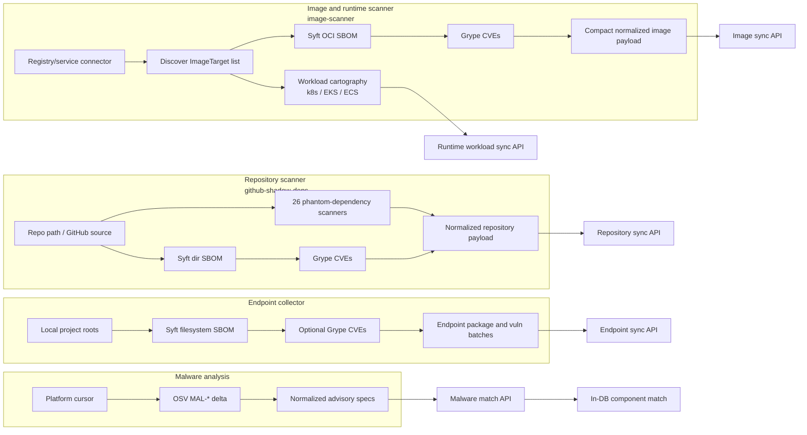
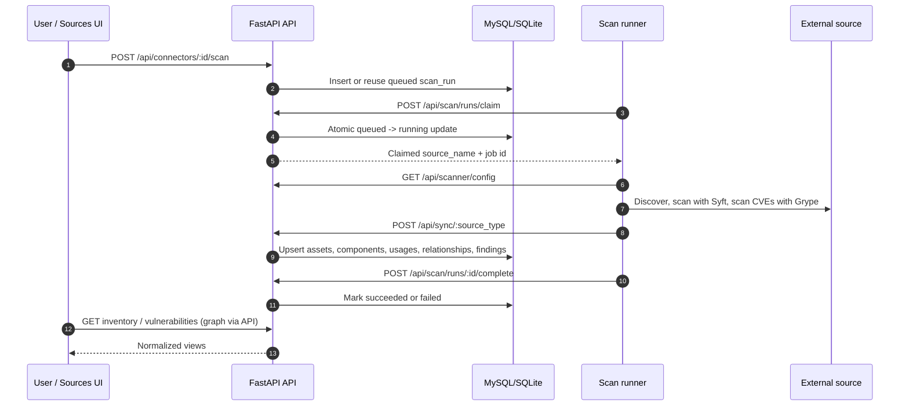

# SupplyDrift Architecture

SupplyDrift aggregates supply-chain evidence from source repositories, shipped
container images, live workloads, and developer endpoints. The platform stores
all scanner output as a normalized asset/component/finding graph, then exposes it
through a React UI and FastAPI API.

## System Overview

The authoritative contributor/operator overview is maintained in the root
README under [Architecture at a glance](../README.md#architecture-at-a-glance).
The diagrams below expand its scanner, storage, and runtime flows.

## Scanner Pipelines

## Platform Data Model

```mermaid
erDiagram
  CONNECTORS ||--o{ SCAN_RUNS : queues
  CONNECTORS ||--o{ ASSETS : owns
  CONNECTORS ||--o{ FINDINGS : reports
  CONNECTORS ||--o{ CONNECTOR_SECRETS : "encrypts credentials in"

  ASSETS ||--o| ENDPOINT_ASSETS : specializes
  ASSETS ||--o| REPOSITORY_ASSETS : specializes
  ASSETS ||--o| CONTAINER_IMAGE_ASSETS : specializes
  ASSETS ||--o| K8S_WORKLOAD_ASSETS : specializes
  ASSETS ||--o| CLOUD_WORKLOAD_ASSETS : specializes
  %% AMI_ASSETS: schema present; no bundled scanner emits AMI assets yet
  ASSETS ||--o| AMI_ASSETS : specializes

  ASSETS ||--o{ ASSET_COMPONENTS : contains
  COMPONENTS ||--o{ ASSET_COMPONENTS : appears_in
  ASSETS ||--o{ FINDINGS : affected_by
  COMPONENTS ||--o{ FINDINGS : affected_package
  COMPONENTS ||--o{ COMPONENT_VULNERABILITY_STATUS : summarized_by
  ASSETS ||--o{ RAW_SBOMS : stores

  ASSETS ||--o{ ASSET_RELATIONSHIPS : source
  ASSETS ||--o{ ASSET_RELATIONSHIPS : target

  USERS ||--o{ SESSIONS : owns
  USERS ||--o{ API_TOKENS : creates
  RUNNER_HEARTBEATS }o--|| SCAN_RUNS : liveness_for
  MALWARE_ALERTS }o--o{ COMPONENTS : matches_by_package_version
```

## Runtime Flows

## Component Map

| Area | Path | Responsibility |
| --- | --- | --- |
| Platform API | `platform/server.py` | FastAPI routes, gzip request handling, static SPA fallback, malware enqueue scheduler |
| Platform store | `platform/app.py` | DB schema (MySQL/SQLite), ingestion normalization, source config, scan queue, graph, alerts |
| Auth and policy | `platform/auth.py`, `platform/authz.py` | Password/session auth, CSRF, bearer token scopes, route authorization |
| Frontend | `platform/frontend/src` | Dashboard, inventory, endpoint, analyzer, vulnerability, alert, source, and admin views |
| Repository scanner | `github-shadow-deps/` | Phantom dependency discovery, optional AI analysis, Syft/Grype repo payload sync |
| Image scanner | `image-scanner/` | Registry/service discovery, OCI SBOM extraction, Grype findings, runtime cartography |
| Endpoint collector | `endpoint-dep-inventory/` | Local Syft inventory, optional Grype CVE batches, gzip upload to endpoint sync API |
| Sandbox runtime | `supplydrift-sandbox/` | Per-invocation Syft/Grype filesystem, environment, process, and network isolation for the Compose repository and image runners |
| Deployment | `docker-compose.yml` | Platform, hardened image and repository runners, malware runner, and shared runner token volume |

## Key Contracts

- Human users authenticate with an httpOnly session cookie and send `X-CSRF-Token`
  on writes. Machine callers use scoped bearer tokens: `runner`, `ingest`, or
  `readonly`.
- Source secrets are stored separately from connector configs, encrypted under
  `SUPPLYDRIFT_SECRET_KEY`, and are only decrypted into runner-token scanner
  config responses. Browser/API config views show configured field names or masks.
- Scan runners are stateless workers. The platform owns source configuration,
  queue state, runner liveness, normalized inventory, and alert state.
- Scanner uploads converge on one internal shape:
  `{assets, components, component_usages, relationships, findings, raw_sboms}`.
- Vulnerabilities are scan-produced `finding_type="cve"` records, usually from
  Grype. OSV malware monitoring is separate and only tracks `MAL-*` advisories.
- The normalized graph is asset-centered: repositories, images, workloads,
  cloud tasks, AMIs, and endpoints all become `assets`; packages become
  `components`; package presence is recorded in `asset_components`.
