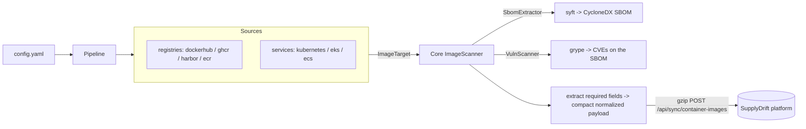

# image-scanner

> Container image SBOM extraction with a pluggable connector framework — **SupplyDrift Vector 2**

Lockfiles describe what a developer *intended* to package; container images
describe what *actually shipped*. `image-scanner` extracts a ground-truth SBOM
from the image itself — OS packages (dpkg/rpm/apk), language packages, and
binaries — and feeds it to the SupplyDrift platform where it is diffed against
the lockfile-derived SBOM.

The design has **three pillars**:

- An **authentication component** (`auth/`) authenticates to each source by any
  configured means — AWS IAM role / access keys / profile / default chain for
  ECR/ECS/EKS, and PAT / robot / basic for the registries.
- The **core scanner** (`core/`) turns *a Docker/OCI image* into a CycloneDX
  SBOM. It is identical no matter where the image came from.
- A **per-source orchestrator** (`connectors/`) discovers *which* images to scan.
  **Registries** (Docker Hub, GHCR, Harbor, ECR) are config-scoped; **services**
  (Kubernetes, ECS, EKS) are exhaustive.



The runner produces the full SBOM (CycloneDX) and feeds it to grype, then
**extracts only the fields the platform stores** — package
name/version/purl/**ecosystem**/**type** and CVE id/severity/fix — into the
platform's normalized `{assets, components, component_usages, findings}` shape and
**gzip-compresses** the upload, rather than shipping the raw SBOM document. On a
small Alpine image this is ~65% smaller gzipped; the saving grows with image size.

Every connector yields the same `ImageTarget`, so the core never knows the
source. Registry connectors enumerate *projects/namespaces -> images -> tags* and,
by default, scan the latest version per image. Service connectors enumerate every
image in every cluster and resolve pull credentials through the shared
`RegistryAuthIndex` — i.e. they reuse the configured registries' authentication.

## Install

Requires Python 3.10+. The scanner core and connectors are **standard-library
only** except PyYAML for the config. External *binaries* (installed separately,
not pip) provide the heavy lifting:

```bash
pip install -r requirements.txt    # just PyYAML

# SBOM + vulnerability engines (Anchore, both daemonless):
#   syft  -> https://github.com/anchore/syft    (SBOM, default)
#   grype -> https://github.com/anchore/grype   (CVEs over the SBOM; set scan_vulnerabilities)
# Connector tooling, as needed:
#   aws     CLI  (ecr / ecs / eks connectors)
#   kubectl      (kubernetes / eks connectors, live scans)
```

**syft is required for any real scan** — even the one-image local example below
fails without it on PATH (`--dry-run --format targets` is the only mode that
never pulls or scans). grype is optional; without it you get SBOMs but no CVEs.

## Usage

There are two ways to run: **local CLI** (scan an image ref straight to a JSON
file, no platform or config) and **connected** (config-driven discovery that
pushes to the platform — the deployable setup).

### Local CLI scan (image ref → JSON file)

```bash
# Scan one or more images directly — no config, no platform. Auto --no-push.
python3 image_scan.py nginx:latest -o result.json
python3 image_scan.py ghcr.io/org/api:1.4 alpine:3.20 -o results.json

# Flattened, human-friendly report instead of the platform payload:
python3 image_scan.py nginx:latest -o report.json --report

# add an OSV malicious-package (MAL-*) check over the scanned packages:
python3 image_scan.py nginx:latest -o out.json --malware
```

`result.json` is the normalized platform payload (`{assets, components,
component_usages, findings}`, re-ingestable via `POST /api/ingest`); `--report`
emits `{target, asset_type, summary: {components, vulnerabilities, malware},
components:[…], vulnerabilities:[{id,severity,package,version,fix}], malware:[…]}`.
Both include grype CVEs + the recommended upgrade. Private images use your ambient
Docker login.

### Connected (config-driven, pushes to the platform)

```bash
cp config.example.yaml config.yaml      # then edit

# Discover only - list the images each source would scan (no pull, no daemon)
python3 image_scan.py --config config.yaml --dry-run --format targets

# Full run: discover -> extract SBOM -> push to the platform
python3 image_scan.py --config config.yaml

# Just one source; scan but do not push; write the payloads to a file
python3 image_scan.py --config config.yaml --source ghcr --no-push --format json -o out.json

# Runner mode: long-running worker that executes scans the UI "Scan" button queues
python3 image_scan.py --serve --config-url http://platform:8765/api/scanner/config
```

### CLI options

| Flag | Description |
|------|-------------|
| `IMAGE …` | Image reference(s) to scan locally — no config/platform needed |
| `--config FILE` | YAML config (required unless image refs are given) |
| `--config-url URL` | Fetch the config from the platform instead of a file (`…/api/scanner/config`) |
| `--source NAME` | Only run named source(s) (repeatable) |
| `--dry-run` | Discover/list target images only; no pull, no scan |
| `--no-push` | Scan but do not POST to the platform |
| `--inventory-only` | Refresh discovered image/topology inventory without running syft or grype |
| `--format {summary,json,targets}` | Result output style (stdout) |
| `-o, --output FILE` | Write output to a file |
| `--report` | Local mode: flattened `{target, asset_type, summary, components, vulnerabilities, malware}` JSON |
| `--malware` | Local mode: also check scanned packages against OSV's malicious-package (`MAL-*`) feed |
| `-v, --verbose` / `-q, --quiet` | Progress log level (stderr) |
| `--log-format {text,json}` | Progress log format — `json` for cron/log aggregation |
| `--serve` | Runner mode: poll the platform for queued image scan jobs and run them |
| `--poll-interval SECONDS` | Runner mode: seconds between polls when the queue is empty (default 15) |
| `--once` | Runner mode: process at most one job, then exit (for cron / tests) |
| `--version` | Print the scanner version and exit |

Progress is logged to **stderr** (discovery, per-image scan with `[N/total]` and
timing, per-push, and a final `done … errors=N` line); the `--format` result goes
to **stdout**. The process exits non-zero when there are errors — wire that to
alerting. For scheduled/automated scans (Docker Hub and every other source) see
**[deploy/README.md](deploy/README.md)** (runner image + Kubernetes CronJob,
systemd timer, GitHub Actions, ECS scheduled task).

## Configuration Model

The config has two top-level source sections (see
[config.example.yaml](config.example.yaml)):

- `registries`: registry accounts to enumerate directly. Each is **config-scoped**
  via a `scan` template — narrow with `scan.projects`, `scan.repositories`,
  `scan.max_images`, `scan.max_images_per_repo` (alias `latest_versions`),
  `scan.include_tags`, `scan.exclude_tags`, `scan.max_projects`, `scan.tag_status`,
  and `scan.pushed_within_days`. The default is the latest version per repo.
- `services`: running platforms enumerated **exhaustively** (every image in every
  cluster). Pull credentials fall back to the configured `registries` — an image
  whose registry is already configured reuses that credential.

**Public / credential-less scanning.** The `auth` block is **optional** — omit it
(or use `auth: {provider: none}`) to scan public content anonymously:

- `images: [...]` — explicit refs scanned **directly** (no discovery API,
  anonymous pull). Works for *any* registry with no credentials, and is the only
  way to scan **public GHCR** (its packages API needs a token even for public).
  Bare Docker Hub names resolve to official images (`alpine` → `library/alpine`).
- Auto-list — Docker Hub `namespaces` and Harbor public projects list anonymously
  with no `auth`. (GHCR auto-list still needs a classic PAT with `read:packages`.)

`auth.provider: docker` opts in to reusing an existing `docker login`; otherwise
omitting auth is pure anonymous.

A top-level `defaults.scan` block is deep-merged into every source's filters.

## Connectors

| Type | Kind | Discovery | Push date | Auth |
|------|------|-----------|-----------|------|
| `dockerhub` | registry | Hub API `/v2/namespaces/{ns}/repositories` + tags | `tag_last_pushed` | PAT/OAT via `/v2/auth/token`, or reuse `docker login` |
| `ghcr` | registry | GitHub Packages REST API (`/orgs|users/{o}/packages`) | `updated_at` | classic PAT (`read:packages`) |
| `harbor` | registry | Harbor v2 `projects -> repositories -> artifacts` | `push_time` | robot account (HTTP Basic) |
| `ecr` | registry | `aws ecr describe-repositories` / `describe-images` | `imagePushedAt` | `aws_auth` -> `get-login-password` |
| `kubernetes` | service | bundled `k8s_cartographer` collector over all contexts | n/a | pull via `RegistryAuthIndex` |
| `eks` | service | `aws eks list-clusters` -> `update-kubeconfig` -> collector | n/a | `aws_auth`; pull via index (ECR fallback) |
| `ecs` | service | `aws ecs list-tasks` -> `describe-tasks` (running images) | n/a | `aws_auth`; pull via index (ECR fallback) |

Type aliases: `docker_hub`/`github`/`aws_ecr`/`k8s`/`aws_eks`/`aws_ecs`.

### Authentication

Authentication is a dedicated component (`auth/`), driven entirely by config:

- **Registries** carry a pull `auth` block discriminated by `provider`
  (`none`/`docker`/`env`/`static`); GHCR/Harbor/Docker Hub credentials come from
  there. Omit it for an anonymous pull; reusing `docker login` requires an
  explicit `provider: docker`.
- **AWS sources** (`ecr`/`ecs`/`eks`) carry an `aws_auth` block resolved by one
  shared `AwsSession`: `profile`, `access_key_id`/`secret_access_key`,
  `role_arn` (assume-role), or — omitting the block — the AWS default credential
  chain (env / IRSA / instance profile).
- **Services** resolve each pull through the `RegistryAuthIndex` built from the
  configured registries, with the service's own `aws_auth` as the ECR fallback.

See **[docs/AUTHENTICATION.md](docs/AUTHENTICATION.md)** for per-environment
recipes (local / CI / in-cluster). For a zero-credential offline smoke test, copy
[config.example.yaml](config.example.yaml) to `config.local.yaml` (gitignored) and
set `auth: { provider: none }`.

### Adding a connector

Drop a module in `src/image_scanner/connectors/`, implement `discover_images()`
(and `registry_auth_for()` if pulls need credentials), and register it in
[src/image_scanner/connectors/__init__.py](src/image_scanner/connectors/__init__.py).
Nothing else changes.

## SBOM + vulnerability engines

**SBOM** — selected via `scanner.extractor`
([`SbomExtractor`](src/image_scanner/core/extractors/base.py)):

- `syft` (default) — `syft registry:<ref> -o cyclonedx-json`, credentials via
  `SYFT_REGISTRY_AUTH_*` env (never on the command line).
- `native` — reserved for a future built-in extractor (dpkg/rpm/apk +
  `go version -m` + ELF) to remove the external-binary dependency.

**Vulnerabilities** — when `scanner.scan_vulnerabilities: true` (default),
**grype** runs over the SBOM syft just produced (`grype sbom:<file> -o json`).
We read grype's **native JSON**, not its CycloneDX output, because the CycloneDX
output drops the **fix version** — the recommended upgrade only lives in
`vulnerability.fix.versions`. Each CVE becomes a finding with
`fix_recommendation: "Upgrade <pkg> to <version>"` (blank when grype has no fix),
deduped by `(id, purl)`. The platform ingests them as `cve` findings and rolls
them up into per-package vulnerability status — no second image pull, no Docker
daemon. grype's DB is pre-baked into the [runner image](deploy/runner.Dockerfile);
set `scan_vulnerabilities: false` to ship SBOMs only.

The Compose runner executes every Syft/Grype target in a fresh, pinned `nono`
capability sandbox. Code and the Grype DB are root-owned/read-only; child
environments contain only tool settings and the current image's pull
credential; runner, Kubernetes, AWS, and ambient Docker credentials are not
granted. Grype has no network access. Image pulls use a registry-host proxy when
the host supports it and emit a warning before falling back to filesystem-only
isolation in the configured `best-effort` mode. Hosted images require the
sandbox; source-tree development defaults to `auto` and warns if `nono` is not
installed (`SUPPLYDRIFT_TOOL_SANDBOX=off` is an explicit local-only override).

## Platform integration

The runner extracts the fields the platform stores into a **compact normalized
payload** (not the raw CycloneDX — that's ~the whole document) and **gzip**-POSTs
it to `POST /api/sync/container-images`. Matches
[platform/connector_contract.md](../platform/connector_contract.md):

```json
{
  "scan_metadata": {"component_count": 9666, "vulnerability_count": 1419},
  "assets": [{
    "asset_type": "container_image", "provider": "aws_ecr",
    "external_id": "<registry>/<repo>@<digest>",
    "details": {"registry_type": "ecr", "registry_url": "...", "repository": "...",
                "image_name": "...", "tag": "...", "digest": "...", "pushed_at": "..."}
  }],
  "components": [{"ref": "...", "name": "openssl", "version": "...", "ecosystem": "deb",
                  "package_manager": "deb", "purl": "pkg:deb/...", "license": "..."}],
  "component_usages": [{"asset_ref": "...", "component_ref": "...", "evidence_path": "..."}],
  "findings": [{"finding_type": "cve", "severity": "high", "component_ref": "...",
                "title": "CVE-...", "fix_recommendation": "Upgrade openssl to ..."}]
}
```

### Cluster topology for `kubernetes` / `eks` sources

When a source is `kubernetes` or `eks`, the runner **also** publishes the cluster
topology to `POST /api/sync/kubernetes-workloads` — `k8s_cluster` + `k8s_workload`
assets, the `workload→cluster` (`belongs_to`) and `image→workload` (`runs_in`)
relationships, and shadow-deployment / unpinned-image findings (the
`k8s_cartographer` payload). This happens automatically in the same run — `image_scan.py`,
the `--serve` runner, and docker-compose — so the platform shows runtime
workloads/clusters, not just bare images. Container-image identity is **aligned**
with the SBOM payload above (same `provider` + `external_id`), so each image's SBOM
and its workload link land on **one** `container_image` asset. (ECS images still
sync as container images only — there is no ECS topology vector.)

## How it relates to the other scanners

- `github-shadow-deps` (Vector 1) scans repositories for non-manifest deps.
- `image-scanner` (Vector 2, this) scans the *images* for ground-truth contents.
- `k8s_cartographer` (Vector 3) maps the *cluster* and flags shadow deployments.

Vector 3 is **bundled inside this component** as the co-located
`src/k8s_cartographer/` package (with its own `k8s_scan.py` entry point and
[docs/k8s-cartographer.md](docs/k8s-cartographer.md)). The Kubernetes connector
here reuses its collector for image discovery (no duplication); Vector 3 still
owns runtime cartography and shadow-deployment detection, runnable standalone:

```bash
python3 k8s_scan.py --from-json cluster-dump.json --push http://127.0.0.1:8765
```

## Development

```bash
python3 -m venv .venv && . .venv/bin/activate
pip install pytest pyyaml
python3 -m pytest -q
```

Tests use a fake extractor and recorded connector fixtures (no network, no
daemon, no cluster). See `tests/`.
