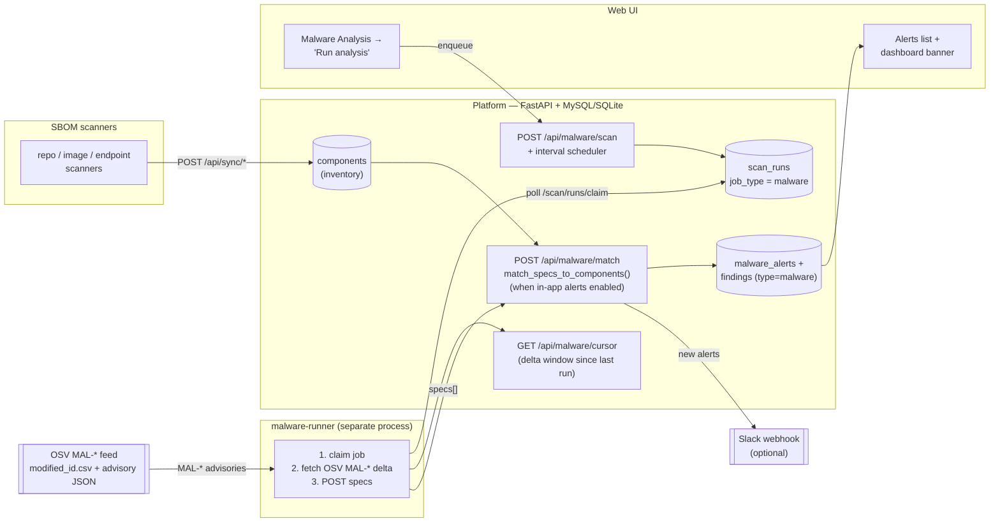

# Malware Analysis — Architecture

SupplyDrift's malware analysis answers one question: **do any packages already in
our inventory appear on OSV's curated malicious-package (`MAL-*`) feed?** It never
trusts a package because it "looks fine" — it matches the SBOM inventory the
scanners already collected against OSV's list of known-malicious packages, and
raises a **critical** alert/finding for every hit when in-app alerts are enabled.

## Diagram



## How it works (the numbered flow)

1. **Inventory exists first.** The repo / image / endpoint scanners sync SBOMs to
   `POST /api/sync/*`; their packages land in the `components` table. Malware
   analysis only ever inspects packages that are *already* in inventory.
2. **Trigger.** Either the UI **Run analysis** button (`POST /api/malware/scan`) or
   the platform's built-in interval scheduler **enqueues a `malware` job** onto the
   `scan_runs` queue. (Disable the scheduler with `MALWARE_SCHEDULER=off`.)
3. **The malware-runner claims the job** (`POST /api/scan/runs/claim`,
   `job_type=malware`) — a separate process, so the network-heavy OSV work never
   competes with the API/UI.
4. **Delta window.** The runner asks `GET /api/malware/cursor` for the window to
   fetch — OSV advisories modified since the last completed match/cursor
   advancement (first use gets a lookback). The cursor advances after a
   successful `/api/malware/match`, including direct mode and before a queued
   runner completes the job. This keeps matching incremental.
5. **Fetch the MAL-\* feed (off-platform).** The runner streams OSV's
   `modified_id.csv` (newest-first), keeps `MAL-*` ids in the window, fetches each
   advisory's JSON from the OSV GCS bucket, and parses `affected[]` into
   `MaliciousSpec`s (package name, ecosystem, affected versions / all-versions).
6. **Match (on-platform).** The runner POSTs the specs to `POST /api/malware/match`.
   The platform loads matching `components` by name and runs
   `match_specs_to_components()` — equal package name, compatible ecosystem, and
   version in the affected set (or `all_versions`).
7. **Alerts + findings.** When `platform_alerts_enabled` is on, every hit upserts a
   row in `malware_alerts` and a **critical `malware` finding** linked to the
   affected component + asset. NEW alerts are dispatched to **Slack** if configured.
   In the current implementation, disabling in-app alerts suppresses matching,
   persistence, and therefore Slack. While the master switch remains enabled, the
   cursor advances whether in-app alerts are on or off, so the next run uses a new
   delta window.
8. **Surface.** The **Alerts** tab on the Malware Analysis page lists advisories
   (package, advisory link, affected assets, a NEW badge, and active status); a
   red **banner** appears on the Dashboard while any alert is active.

## Run it locally (script)

`platform/scripts/run_malware_analysis.py` is a local-development helper that runs
the analysis on demand against a platform with authentication disabled. Use two
terminals from the repository root:

```bash
# Terminal 1: start the loopback-only development platform
cd platform
SUPPLYDRIFT_AUTH=disabled python3 run.py --port 8765

# Terminal 2: attempt a demo with a recently published OSV MAL-* advisory
python3 platform/scripts/run_malware_analysis.py --url http://127.0.0.1:8765 --demo

# Or analyze the existing inventory with a bounded OSV window
python3 platform/scripts/run_malware_analysis.py --url http://127.0.0.1:8765 --lookback-minutes 120
```

It auto-enables the malware master toggle, optionally seeds a known-malicious
package (`--demo`), fetches the OSV `MAL-*` feed, POSTs to `/api/malware/match`,
and prints the resulting alerts.

`--demo` is feed-dependent rather than a fixed fixture. It prefers a recent npm
advisory affecting all versions, then seeds version `1.0.0`; if no such advisory
is present in the selected lookback, the fallback advisory may not affect that
version and the run can legitimately report zero matches. Increase
`--demo-lookback-days` or test against a package/version known to be affected by
the current feed.

**Authentication limitation:** this helper performs READ (`summary`, `alerts`),
OPERATE (`settings`), QUEUE (`malware/match`), and, with `--demo`, INGEST requests.
No current bearer-token scope combines all of those capabilities: `runner` has
QUEUE+INGEST, `ingest` has INGEST, and `readonly` has READ. Consequently, `--token`
cannot complete this helper's end-to-end workflow while authentication is enabled.
Use the auth-disabled loopback development start above, or use the real malware
runner for an auth-enabled platform.

For an auth-enabled manual run, enable Malware Analysis in the UI, create a
`runner` token as an admin, and run the queue-free runner path:

```bash
SUPPLYDRIFT_RUNNER_TOKEN='sdp_...' \
  python3 platform/malware_runner.py \
  --platform-url http://127.0.0.1:8765
```

That runner-token path can read the malware cursor and submit matches, but it does
not seed demo data, change settings, or read back alerts; inspect results in the
authenticated UI. To exercise the queue instead, click **Run analysis** first and
run `malware_runner.py --once --platform-url ...`; `--once` processes at most one
already-queued malware job. Compose already runs the long-lived `--serve` form.

Illustrative helper output:

```text
malware analysis: enabled
demo: ingested malicious package npm/@johntaohunter/forge-jsx (MAL-2026-5674) into repo 'acme/evil-app'
matching 25 OSV MAL-* advisories against inventory …
result: matched=1  new=1  active_total=1  advisories_scanned=25
1 active malware alert(s):
  • MAL-2026-5674  @johntaohunter/forge-jsx@1.0.0 (npm)  affects 1 asset(s)
```

## Two access modes

`osv_malware.py` supports two ways to reach OSV; the platform uses **feed mode**:

| Mode | Who | How |
|---|---|---|
| **feed** | platform malware-runner | Stream `modified_id.csv` → fetch `MAL-*` advisory JSON → `MaliciousSpec`s → match against the whole inventory. Incremental via the cursor. |
| **query** | scanner CLIs (`--malware`) | `POST /v1/querybatch` for the components just scanned; keep results whose id starts with `MAL-`. Point-in-time, no inventory needed. |

## Key components

- `platform/osv_malware.py` — OSV client + the pure matcher (`match_specs_to_components`).
- `platform/app.py` — `scan_malware_delta` / `match_malware_specs` (alerts + findings + cursor), `malware_cursor`, `list_alerts`, settings.
- `platform/server.py` — `POST /api/malware/scan`, `POST /api/malware/match`, `GET /api/malware/cursor`, `GET /api/alerts`.
- `platform/malware_runner.py` — the off-platform runner (claims jobs, fetches OSV, POSTs specs).

## Notes

- **Inventory-scoped:** matching considers only package records already present in
  `components`; advisories for names absent from inventory do not create alerts.
- **Idempotent:** alerts upsert by `(advisory_id, package, version, ecosystem)`;
  findings use stable type/asset/component/advisory identities. Re-running refreshes
  those records (and increments the alert count) rather than creating duplicates.
- **Delta liveness:** unchanged runs still advance the cursor.
- **Coverage boundary:** feed mode checks advisories modified inside the cursor
  window (the first-run lookback defaults to 24 hours), not OSV's full historical
  corpus. A newly inventoried package whose older advisory does not change will not
  be reconsidered by the delta runner; scan-time `--malware` query mode checks the
  packages in that individual scan instead.
- **Additive alert lifecycle:** sync and malware matching are upsert-only. Alerts
  remain `active` even if a package later disappears from inventory; there is
  currently no automatic reconciliation or acknowledge/resolve API.
