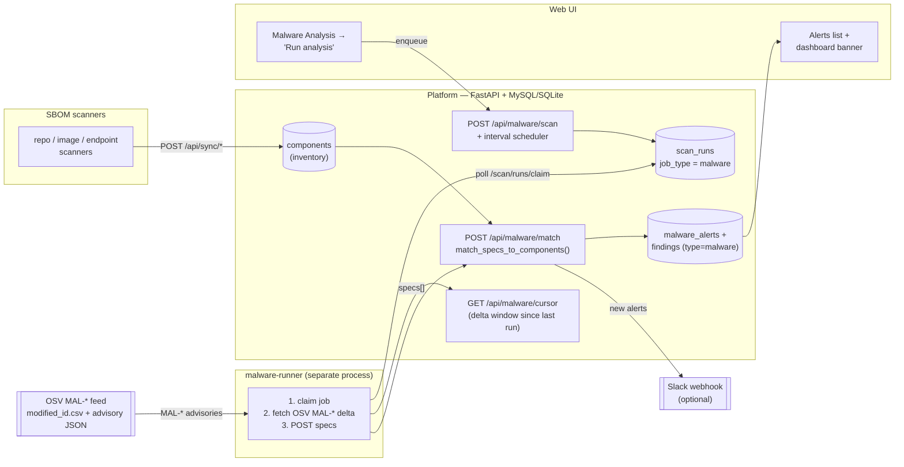

# Malware Analysis — Architecture

SupplyDrift's malware analysis answers one question: **do any packages already in
our inventory appear on OSV's curated malicious-package (`MAL-*`) feed?** It never
trusts a package because it "looks fine" — it matches the SBOM inventory the
scanners already collected against OSV's list of known-malicious packages, and
raises a **critical** alert/finding for every hit.

## Diagram



## How it works (the numbered flow)

1. **Inventory exists first.** The repo / image / endpoint scanners sync SBOMs to
   `POST /api/sync/*`; their packages land in the `components` table. Malware
   analysis only ever inspects packages that are *already* in inventory.
2. **Trigger.** Either the UI **Run analysis** button (`POST /api/malware/scan`) or
   the platform's built-in interval scheduler **enqueues a `malware` job** onto the
   `scan_runs` queue. (Disable the scheduler with `MALWARE_SCHEDULER=off`.)
3. **The malware-runner claims the job** (`POST /api/scan/runs/claim`,
   `job_type=malware`) — a separate process, so the network-heavy OSV work never
   competes with the API/UI.
4. **Delta window.** The runner asks `GET /api/malware/cursor` for the window to
   fetch — OSV advisories modified since the last successful run (first run uses a
   lookback). This keeps each run incremental.
5. **Fetch the MAL-\* feed (off-platform).** The runner streams OSV's
   `modified_id.csv` (newest-first), keeps `MAL-*` ids in the window, fetches each
   advisory's JSON from the OSV GCS bucket, and parses `affected[]` into
   `MaliciousSpec`s (package name, ecosystem, affected versions / all-versions).
6. **Match (on-platform).** The runner POSTs the specs to `POST /api/malware/match`.
   The platform loads matching `components` by name and runs
   `match_specs_to_components()` — equal package name, compatible ecosystem, and
   version in the affected set (or `all_versions`).
7. **Alerts + findings.** Every hit upserts a row in `malware_alerts` and a
   **critical `malware` finding** linked to the affected component + asset. NEW
   alerts are dispatched to **Slack** (if configured). The cursor advances so the
   next run is a pure delta.
8. **Surface.** The **Alerts** tab on the Malware Analysis page lists advisories
   (package, advisory link, affected assets, NEW/UPDATE); a red **banner** appears
   on the Dashboard while any alert is active.

## Run it locally (script)

`platform/scripts/run_malware_analysis.py` runs the analysis on demand against a
running platform — the same work the scheduled `malware-runner` does.

```bash
# 1) start the platform (auth off for a quick local spin)
cd platform && SUPPLYDRIFT_AUTH=disabled python3 run.py --port 8765 &

# 2a) SEE it work on a clean inventory — seed a REAL OSV-flagged malicious npm
#     package, then detect it (fast + deterministic):
python3 platform/scripts/run_malware_analysis.py --url http://127.0.0.1:8765 --demo

# 2b) REAL run over whatever is already in your inventory (bound the OSV window so
#     the first run isn't slow):
python3 platform/scripts/run_malware_analysis.py --url http://127.0.0.1:8765 --lookback-minutes 120
```

It auto-enables the malware master toggle, optionally seeds a known-malicious
package (`--demo`), fetches the OSV `MAL-*` feed, POSTs to `/api/malware/match`,
and prints the resulting alerts. If the platform has auth on, pass a runner/ingest
token with `--token` (or set `SUPPLYDRIFT_RUNNER_TOKEN`). Example output:

```text
malware analysis: enabled
demo: ingested malicious package npm/@johntaohunter/forge-jsx (MAL-2026-5674) into repo 'acme/evil-app'
matching 25 OSV MAL-* advisories against inventory …
result: matched=1  new=1  active_total=1  advisories_scanned=25
1 active malware alert(s):
  • MAL-2026-5674  @johntaohunter/forge-jsx@1.0.0 (npm)  affects 1 asset(s)
```

(There's also the bundled runner directly: `python3 platform/malware_runner.py
--once --platform-url http://127.0.0.1:8765` — but it relies on the platform cursor
for its window and won't seed a package, so use the script above for a quick demo.)

## Two access modes

`osv_malware.py` supports two ways to reach OSV; the platform uses **feed mode**:

| Mode | Who | How |
|---|---|---|
| **feed** | platform malware-runner | Stream `modified_id.csv` → fetch `MAL-*` advisory JSON → `MaliciousSpec`s → match against the whole inventory. Incremental via the cursor. |
| **query** | scanner CLIs (`--malware`) | `POST /v1/querybatch` for the components just scanned; keep results whose id starts with `MAL-`. Point-in-time, no inventory needed. |

## Key components

- `platform/osv_malware.py` — OSV client + the pure matcher (`match_specs_to_components`).
- `platform/app.py` — `scan_malware_delta` / `match_malware_specs` (alerts + findings + cursor), `malware_cursor`, `list_alerts`, settings.
- `platform/server.py` — `POST /api/malware/scan`, `POST /api/malware/match`, `GET /api/malware/cursor`, `GET /api/alerts`.
- `platform/malware_runner.py` — the off-platform runner (claims jobs, fetches OSV, POSTs specs).

## Notes

- **Inventory-scoped:** a malicious package is only flagged if it's actually in
  your SBOMs — zero false positives from packages you don't have.
- **Idempotent:** alerts/findings upsert by `(advisory_id, package, version,
  ecosystem)`, so re-running just refreshes `last_seen`.
- **Liveness:** unchanged runs still advance the cursor; alerts clear when the
  package leaves inventory on a later sync.
